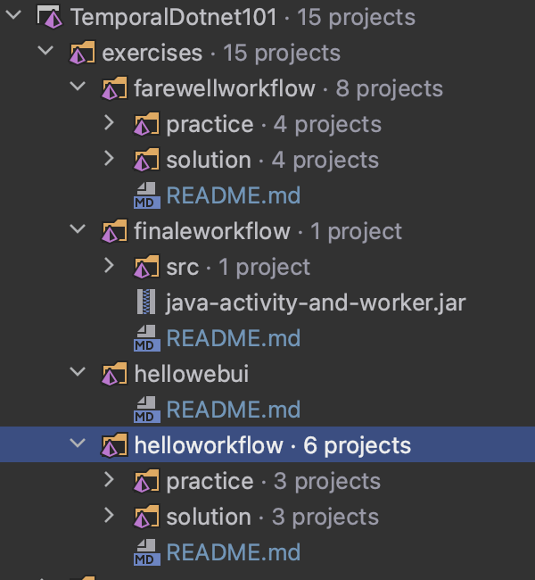

# \*Unofficial\* Temporal 101 dotnet code solutions

This repo contains my unofficial .NET code solutions for the temporal 101 typescript course.

At the time of writing no .NET course exists (as it's still in beta), but I've ported the typescript course as a learning exercise. To the best of my knowledge the solutions are correct. Some of the exercises contain some minor modifications but I've included links to the original README's in each of the exercises.

Typescript course link - https://learn.temporal.io/courses/temporal_101/typescript

## Prerequisites

- Temporal CLI - https://docs.temporal.io/cli
- .NET 7 - https://dotnet.microsoft.com/en-us/download/dotnet/7.0
- Your favourite IDE

> Note - I used VSCode to complete the course, but I've added all of the projects under exercises to the solution in the root of the repo if you'd prefer to open it in Rider or Visual Studio. Projects for each of the exercises are split into solution folders like below (each contain their own README)



## Exercises

1 - [Hello Workflow](exercises/helloworkflow/README.md)

2 - [Hello Web UI](exercises/hellowebui/README.md)

3 - [Farewell Workflow](exercises/farewellworkflow/README.md)

4 - [Finale Workflow](exercises/finaleworkflow/README.md)

## Repo structure

- `./exercises` contains the exercises from the course.
- Some of the exercises are split into `/practice` and `/solution` folders.
- The `/practice` folders contains a partially complete solution which you can complete yourself.
- The `/solution` folders contains a complete reference solution.

## Running the temporal-server

You'll need a temporal server implementation running for each of the exercises. The easiest way to do this is to use the temporal CLI. Run the below to start a dev server:

```sh
temporal server start-dev
```

> Note - when using the temporal CLI the server will be available at `localhost:7233` and the webUI at `http://localhost:8233/`
