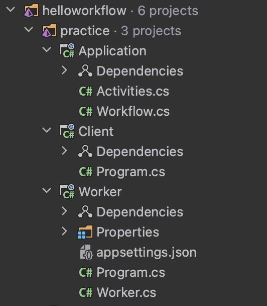

# Exercise 1: Hello Workflow

This readme was ported from the official typescript tutorial [hello-workflow/README.md](https://github.com/temporalio/edu-101-typescript-code/blob/main/exercises/hello-workflow/README.md).

During this exercise, you will

- Set up a new project using the Temporal Package Initializer
- Review the business logic of the provided Workflow Definition
- Modify the Worker initialization code to change the task queue name
- Run the Worker initialization code to start the Worker process
- Execute the Workflow from the command line

> Note: This exercise contains a notable difference to the typescript reference solution it was ported from. The typescript solution starts by scaffolding your own project using the CLI, but as I haven't created a templating solution I've just created a blank starter solution under the /practice folder instead.

## Part A: Set up a new project

The exercise is split into 2 top level folders

`./solution` contains a complete reference solution for the exercise.
`./practice` contains a partially complete solution for the exercise which we will modify.

The practice folder should look something like:



Our practice solution contains the following projets:

- `Application` - A .NET class library where we'll add our Workflow and Activities.
- `Client` - A .NET console application that interacts with the temporal server to start a Workflow.
- `Worker` - A .NET application with a background service that runs our temporal Worker.

## Part B: Review the Workflow Business Logic

1. Open the [Application/Activities.cs](./practice/Application/Activities.cs) file in the editor and review the business logic.
2. Open the [Application/Workflow.cs](./practice/Application/Workflow.cs) file in the editor and review the `greet` constant. Take special care to look at the Start-to-Close Timeout option.

## Part C: Change the Task Queue Name for the Worker

1. Open the [Worker/Program.cs](./practice/Worker/Program.cs) file
2. Change the task queue name to `greeting-tasks`
3. Save your changes
4. Repeat this process in the [Client/Program.cs](./practice/Client/Program.cs) file

## Part D: Start the Worker

> Note: Ensure your temporal server is running first, see instructions in root [README.md](../../README.md)

```command
dotnet run --project ./exercises/helloworkflow/practice/Worker/Worker.csproj
```

## Part E: Start the Client

1. Open another terminal window in the environment
2. Run the following command:

```command
dotnet run --project ./exercises/helloworkflow/practice/Client/Client.csproj
```

This command starts the Workflow, shows the Workflow's unique identifer, and prints the result of the `greeting` Activity.

If you have time, continue with the optional part of the exercise below to see how to view the result using `tctl`.

## Part F (Optional): Display the Result from temporal-cli

You can run the following command to display the result of a Workflow Execution:

```command
temporal workflow show --workflow-id <your-workflow-id-from-previous-output>
```

This command shows you a lot of information. We will cover this output later in the course.

It is also possible, and often more convenient, to view this information using the Web UI. You will have a chance to do this in the next exercise.
